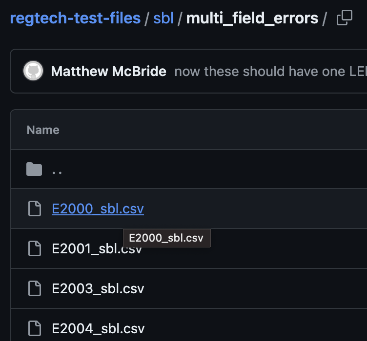
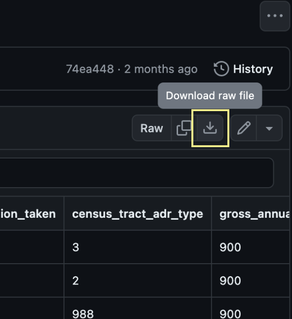
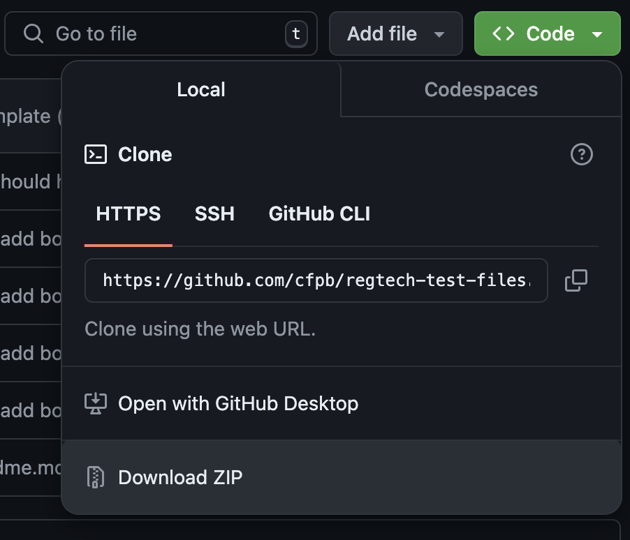

## Lending Application Register (LAR) Test Files

This is a repo that contains test files that can be used to explore various parts of the beta for the Small Business Lending Data Filing Platform, also referred to as SBL or 1071. There are two different subfolders within the small_business_lending folder - demo_files and dev_files. Their respective readmes have additional detail, but here's a high-level overview of their contents.

### demo_files

These are files that are designed to be used to explore different testing scenarios on the beta for the Small Business Lending Data Filing Platform and to help users navigate through different stages of the platform. 

### dev_files

These are files that can be used to explore different testing scenarios on the beta for the Small Business Lending Data Filing Platform but more generally exist to show the structure of files that will and will not pass the Small Business Lending Data Filing Platform validation checks. 

- Each folder contains output of the [Mock Data Generator](https://github.com/cfpb/regtech-mock-data-generator).
- These files can be used with the beta for the Small Business Lending Data Filing Platform or with the [SBL data validator](https://github.com/cfpb/regtech-data-validator).

## How to Download Files From This Repository for Use

To download files from this GitHub repository web page for use, click on the file listed in the repo:

Once the file is opened in GitHub in the browser, click on the Download raw file button in the upper right hand corner of the table display (shown in yellow): 

Repeat this process for any individual files that you would like to download for testing with the beta for the Small Business Lending Data Filing Platform. 

You may also download this entire repo as a ZIP file by clicking Download ZIP from the Code menu button on the main page of this repo:

